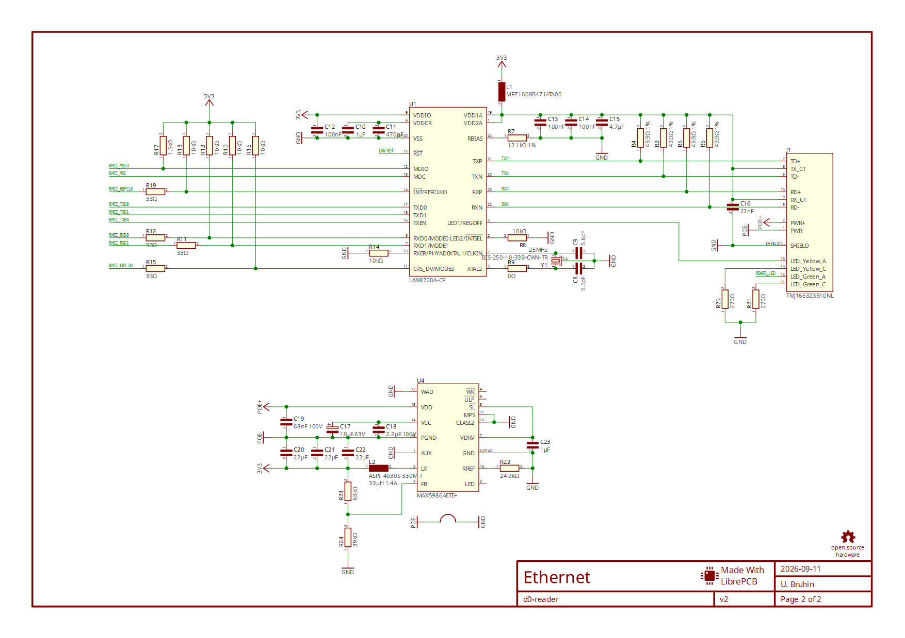

# LibrePCB-MCP-Server

> **WIP — experimental software under active development.** Interfaces and supported
> behavior may change. This is not a finished product or an official LibrePCB integration.

A local MCP server that lets a compatible AI client inspect saved LibrePCB projects,
run electrical and board-rule checks, view schematic previews, and export PDF and
manufacturing files. It works on isolated copies and preserves the source design.

The current prototype targets **Windows x64, Python 3.12 and LibrePCB 2.1.1**.
It uses the official **MCP Python SDK 2.2.0** over STDIO. The server makes no model
API calls and needs no subscription credentials or model API keys.

## What works today

| Tool | Current behavior |
| --- | --- |
| `get_status` | Reports the server/LibrePCB versions, readiness and supported operations. |
| `open_project` | Validates an allowed, closed `.lpp` project and creates a saved snapshot. |
| `get_project_summary` | Returns project metadata, boards, schematic sheets and counts. |
| `list_components` | Lists references, raw values, typed attributes and signal counts, with pagination. |
| `list_nets` | Lists circuit nets and connected signal/component counts, with pagination. |
| `run_checks` | Runs real ERC/DRC and separates approved findings, unapproved findings and check failures. |
| `export_preview` | Exports schematic PNGs and attaches one selected sheet as a native MCP image. |
| `run_output_job` | Runs a server-owned schematic PDF or Gerber/Excellon job in a new output directory. |
| `create_value_edit` *(experimental, opt in)* | Creates a separate resistor-value candidate, validates saving/reopening and compares checks. Preserves the original. |

Checks and exports use the pinned LibrePCB CLI. A rule violation is a valid check
result; missing, contradictory or unfamiliar diagnostics are never treated as a
pass. Exports use fixed server-owned jobs and filenames, and return artifact paths,
hashes and raw diagnostic paths.

Eight tools are enabled by default. The ninth requires the experimental editing
option described below.

**Not implemented yet:** general design editing, component placement, wiring, routing,
live access to unsaved GUI state, general library authoring, and support for other
operating systems or LibrePCB releases. Current editing is limited to one typed
resistance value in a separate candidate; it does not control the live editor.

## Example workflow

After connecting the server, ask your MCP client:

> Open my saved LibrePCB project, summarize its components and nets, run ERC and
> DRC, and show the Main schematic. Report approved and unapproved findings
> separately, then export the schematic PDF.

The client opens the absolute `.lpp` path and uses the returned project handle for
subsequent tools. For multi-board projects, select a board explicitly for DRC and
manufacturing exports. Component values may be templates such as `{{RESISTANCE}}`;
the reader exposes the separate typed attributes instead of guessing the display value.



*Real LibrePCB output received through MCP, using the included CC0 D0 reader
sample by U. Bruhin. This is a compatibility example, not a manufacturing approval.*

## Windows quickstart

Install Python **3.12 x64**, clone this repository, and run from its folder in PowerShell:

```powershell
powershell.exe -NoProfile -ExecutionPolicy RemoteSigned -File .\scripts\bootstrap.ps1 -PythonExe python
.\.venv\Scripts\python.exe scripts\prepare_demo.py --verify
```

`python` must resolve to a real Python 3.12 interpreter. You can pass its absolute
path instead. The bootstrap downloads the pinned portable LibrePCB build, checks
its hash/signature, and installs the hash-locked Python dependencies and local package.

The demo command creates a fresh sample plus **Codex TOML**, **Claude Desktop JSON**
and a sample prompt under `work/demo-<id>/`. Merge the relevant server entry into
your client's configuration, preserving existing entries. The script generates
snippets only; it does not modify client settings. The client starts the STDIO
server when needed.

With `--verify`, it also runs the sample through the generated configuration and
leaves actual previews, a PDF and a result report in a new review directory.
See [the owner walkthrough](docs/OWNER_TRIAL.md) for what to inspect and how to
try the generated prompt in your client.

See [Windows setup](docs/WINDOWS_SETUP.md) for complete commands, configuration and
troubleshooting. Codex host tool calls and native image delivery have been tested;
Claude connection and an owner-followed installation trial are still pending.

## Experimental resistor editing

To prepare a sample configuration with editing enabled:

```powershell
.\.venv\Scripts\python.exe scripts\prepare_demo.py --experimental-edits --verify
```

This adds `--enable-experimental-edits` to the generated server arguments and
allows 300 seconds per tool. Nothing is installed into your client automatically.

The tool takes a component ID, the current source revision and a decimal value
in the resistor's **existing unit**. For example, R17's `"2.2"` means 2.2 kΩ
because its RESISTANCE attribute is already in kiloohms. It rejects unsupported
component shapes, selected parts, extra attributes, stale revisions, locks and
unapproved rule findings. It requires one board and preserves the raw template.

The result includes a new candidate project handle for inspection, previews and
exports, plus the saved project path and validation report. The original remains
unchanged. To abandon the edit, close the candidate and discard its copy.
Candidate handles last for that server session and become stale if you save the
candidate in the GUI. Copy a candidate into an allowed project folder before
opening it as a new source in a later session. Chaining candidate edits is deferred.

Day 5 adds cancellation and a time budget for the whole operation, including
waiting for other work: 90 seconds by default, or 240 with experimental editing.
Failed operations retain their partial copies and diagnostics; retries use a new
directory. A report-storage failure cannot turn an edit into a successful result.
See [reliability and recovery](docs/DAY5.md) for timeout settings and cleanup limits.

The real LibrePCB editor displayed the tested change **1.5 kΩ → 2.2 kΩ**, saved
it and reopened it successfully. This is a narrow development experiment; see
[Day 4 details](docs/DAY4.md) and [evidence](evidence/2026-09-11-day4/README.md).

## Current validation

The included real sample has **97 components, 48 nets, one board and two schematic
sheets**. Its baseline retains 2 approved ERC findings and 16 approved DRC findings,
with no unapproved findings. Tests also introduce a disconnected net and a trace
below the board's minimum width, then verify LibrePCB reports the new faults.

```powershell
.\.venv\Scripts\python.exe -m unittest discover -s tests -v
.\.venv\Scripts\python.exe scripts\verify_mcp.py
.\.venv\Scripts\python.exe scripts\verify_day3.py
.\.venv\Scripts\python.exe scripts\verify_day4.py
```

Day 3 recorded 33 unit/adapter tests, 82 inspection MCP checks, 73 check/export/image
checks and 12 Codex host checks. Day 4 expands this to **42 unit/adapter tests**,
reruns the **82 inspection checks**, and passes **15 Codex host checks** including
the experimental edit. The Day 4 packet records the full candidate/rollback MCP
acceptance separately. All 184 original source files remain unchanged. Received
schematic images and the GUI's saved/reopened value were visually inspected.

Day 5 passes **57 unit/adapter tests** and **38 reliability checks**, including
real cancellation, interrupted CLI execution and recovery after a report-storage
failure. The installed package also passes the full 82/73/103-check regressions
and 15 Codex host checks. See [Day 5 evidence](evidence/2026-09-12-day5/README.md).

Day 6 installs from a fresh GitHub checkout and Python environment on the same
Windows machine, including a new verified LibrePCB download. Repeat setup preserves
existing samples. All **57 unit/adapter tests** pass; generated-config walkthroughs
pass **21 checks / 10 calls** by default and **26 / 12** with experimental edits.
The latter also passes from the installed noneditable dev6 wheel. Reviewable
images, PDF and reports are ready; owner acceptance is pending. See
[Day 6 evidence](evidence/2026-09-14-day6/README.md).

These results do not establish electrical correctness, production readiness or
compatibility with arbitrary designs. A personal-project trial and fresh-machine
installation remain later acceptance work. The GUI and editing evidence covers
the narrow resistor example above, not general editor automation.

## Working boundaries

- Closed, saved projects under explicitly configured local roots.
- Lock/recovery entries, stale revisions, linked paths and unsupported formats are rejected.
- New directories for exports; existing output is never silently overwritten.
- Bounded tool results, preview image sizes, parser work and retained CLI logs.
- No arbitrary shell, Python, caller-selected output paths or project-job execution.
- Retained snapshots/artifacts still need manual cleanup between inactive sessions.

Implementation details and exact limits are in [Day 3 notes](docs/DAY3.md) and
[Day 2 inspection notes](docs/DAY2.md), plus [Day 4 editing](docs/DAY4.md).

## Project context and roadmap

- [STATUS.md](STATUS.md): current implementation, real tests and next task.
- [PLAN.md](PLAN.md): milestone plan and release gates.
- [SPEC.md](SPEC.md): implemented versus proposed interfaces.
- [HANDOFF.md](HANDOFF.md): context for continuing in another coding client.
- [RESEARCH.md](RESEARCH.md): verified sources and historical design references.

The repository preserves source, documentation, fixture, test evidence and project
history. Downloaded runtimes, virtual environments, temporary work and credentials
are excluded and can be recreated from the setup instructions.

## License and attribution

A software license for the server has not yet been chosen. The included D0 reader
fixture is **CC0-1.0**; see [fixture provenance](tests/fixtures/README.md). LibrePCB
and other dependencies retain their own licenses and are not bundled into this repository.
