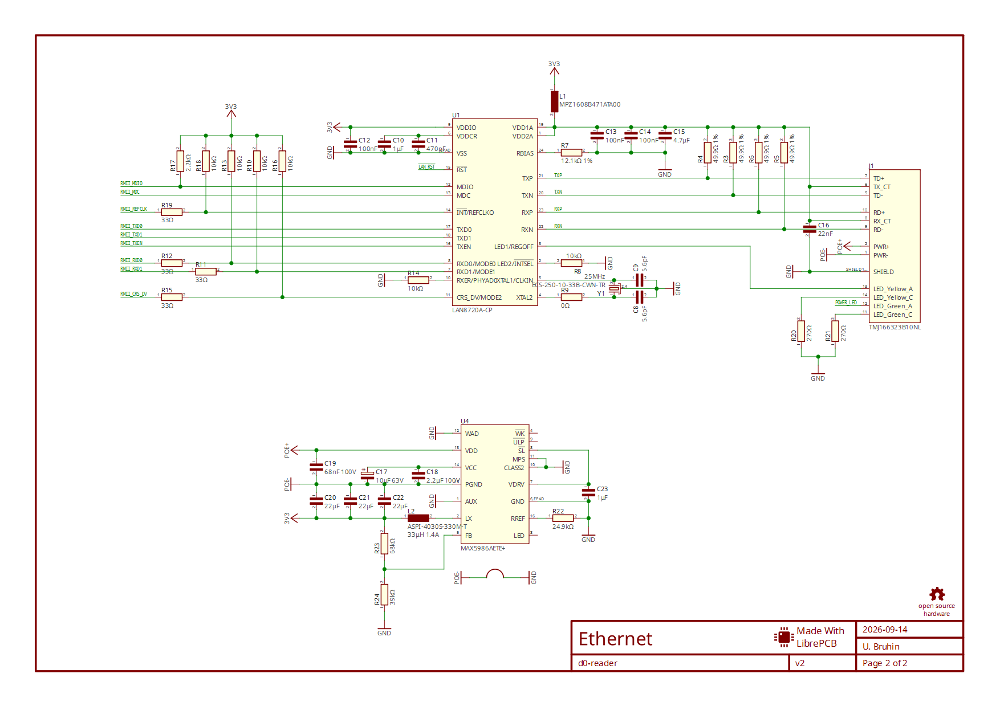

# Day 6: fresh setup and packaged sample walkthrough

Recorded September 14, 2026. **Engineering checks pass; owner acceptance pending.**
Server `0.1.0.dev6`, SDK 2.2.0, Python 3.12.14 x64, LibrePCB 2.1.1 / stable format 2.
Fresh GitHub checkout commit: `718c50d1ba99e069822d8786c4d4b8528471a8f6`.

## Actual results

| Evidence | Result |
| --- | --- |
| [Fresh install](fresh-install.json) and [setup log](setup/fresh-bootstrap.txt) | No venv/runtime initially. Full new 85,142,354-byte LibrePCB download, hash/signature/version verification, new venv, 36 hash-locked dependencies and package installation passed. |
| [Default sample](fresh-default.json) | 21 checks / 10 real MCP calls, all eight tools. |
| [Experimental sample](fresh-edit.json) | 26 checks / 12 calls, nine tools, validated R17 candidate. |
| [Repeat setup/package record](package-trial.json) | Repeat setup preserved all 1258 existing demo files; wheel installed and dependency/resource/module checks passed. |
| [Unit/adapter suite](setup/package-fresh-unit-tests.txt) | 57 passed in 129.657 seconds; includes synthetic fault cases. |
| [Installed wheel sample](wheel-edit.json) | 26 checks / 12 actual MCP calls using noneditable dev6 from site-packages. |
| [Workspace sample](workspace-edit.json) | 26 checks / 12 calls; original/candidate native PNGs visually inspected by Codex. |
| [Prerequisite failures](prerequisites.json) | Missing Python and corrupt cached ZIP both rejected as expected, preserving existing data. |

All four sample runs preserve every source file and have empty server stderr.
The fixture retains 97 components, 48 nets, one board and two sheets, with
2 approved ERC / 16 approved DRC findings and zero unapproved findings. Actual
PNG delivery, PDF and 11 manufacturing files pass; candidates validate R17
1.5 → 2.2 kΩ. The wheel images below match the visually reviewed workspace images.

## Failures retained

The [initial setup](initial-install.json), starting at Day 5 commit `e488b1c`,
failed under Restricted script policy. A process-only RemoteSigned retry then
hit a host-aborted download at 77,283,328 bytes; its [actual log](setup/initial-download-failure.txt)
is retained, as is the incomplete ZIP in the original temporary checkout.
The fixed installer downloads into unique partial files and accepts only a
verified hash. Its final full download passed. A prerequisite test initially
exposed an inherited PowerShell 7 module-path mismatch in Windows PowerShell 5.1;
explicit built-in imports resolved it. [Final negative results](prerequisites.json)
exercise the intended failures; they are not LibrePCB integration tests.
The [initial module failure](setup/initial-module-selection-failure.txt) and
[prerequisite harness](setup/prerequisite-harness.py.txt) are retained as well.

## Record layout and limits

[Summary](summary.json) records run directories and hashes.
[Final consistency review](final-review.json) passes 65 checks over the package,
pins, evidence, documentation and cleanup; these are not additional native tests.
[Artifact map](artifact-map.json) maps absolute diagnostic references to
**168 raw CLI log files** and **31 operation reports** in this packet.
`setup/` contains actual installer, package and test logs; `configs/` contains
sanitized generated snippets and prompts. Placeholders `<REPO>`, `<CHECKOUT>`,
`<TRIAL>`, `<INITIAL_TRIAL>`, `<PREREQUISITE_TRIAL>`, `<BASE_PYTHON>`, `<USER>` and `<TRUNCATED_PATH>`
replace machine paths. These evidence snippets must not be pasted unchanged into
a client; generate usable paths with `prepare_demo.py`.
Diagnostic text uses LF endings and removes trailing whitespace for Git; original
unmodified logs remain in the recorded local trial folders. Initial staging found
PowerShell's trailing spaces/blank lines; the normalized packet passes the final
staged and working-tree whitespace checks.

The fresh checkout/environment is on the same Windows machine, reusing its
existing base Python, certificate store and pip download cache. This is not a
fresh Windows machine, owner-followed installation, persistent live UI connection
or personal-design trial. No model turn or Claude connection was attempted.
Native GUI save/reopen remains Day 4's historical evidence. Day 5's broader
integration regressions remain unchanged; Day 6 reran the sample workflows above.
Owner review was requested but no acceptance received. Server remains WIP.
